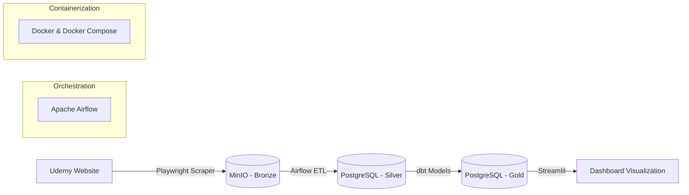
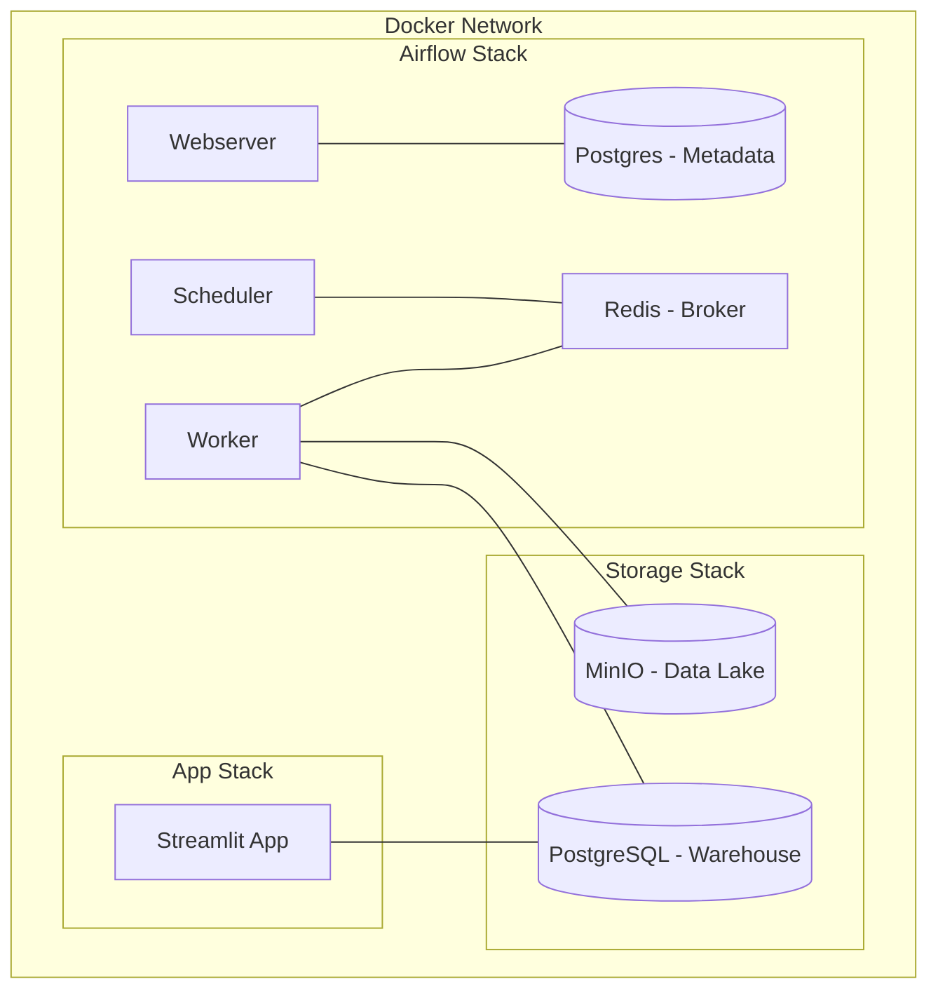

# Udemy Market Intelligence - End-to-End Data Pipeline


Dự án **Udemy Market Intelligence** là một hệ thống Data Pipeline hoàn chỉnh, tự động hóa quy trình từ thu thập dữ liệu (Scraping), lưu trữ (Data Lake/Warehouse), biến đổi (Transformation) đến trực quan hóa (Visualization) nhằm phân tích thị trường khóa học trên Udemy.

---

## 🏗 Kiến trúc Hệ thống (Architecture)

Dự án được xây dựng dựa trên kiến trúc **Medallion (Bronze - Silver - Gold)** để đảm bảo tính toàn vẹn và chất lượng dữ liệu:



### 🐳 Kiến trúc Docker (Docker Architecture)

Toàn bộ hệ thống được container hóa giúp đảm bảo tính nhất quán giữa các môi trường phát triển và triển khai. Các dịch vụ chính bao gồm:



*   **Airflow Webserver/Scheduler/Worker**: Điều phối và thực hiện các script Python (Scraping, ETL).
*   **Redis**: Làm nhiệm vụ hàng đợi (Broker) cho Celery Executor của Airflow.
*   **MinIO**: Lưu trữ file thô (CSV/Parquet) dưới dạng Object Storage.
*   **Postgres Warehouse**: Lưu trữ dữ liệu có cấu trúc và phục vụ truy vấn cho dbt/Streamlit.
*   **Docker Volumes**: Đảm bảo dữ liệu trong database và MinIO không bị mất khi container khởi động lại.

---

## 💎 Quy trình Xử lý Dữ liệu (Medallion Architecture)

Dữ liệu được vận chuyển và tinh chế qua 3 tầng tiêu chuẩn để đảm bảo độ tin cậy và khả năng phân tích:

### 1. 🟫 Tầng Bronze (Raw Data)
*   **Nguồn:** Dữ liệu thô thu thập trực tiếp từ script Playwright Scraper.
*   **Lưu trữ:** MinIO Object Storage.
*   **Đặc điểm:** Dữ liệu nguyên bản, chưa qua chỉnh sửa, được lưu dưới định dạng CSV hoặc Parquet kèm theo timestamp để phục vụ việc truy xuất lịch sử (Audit).

### 2. ⬜ Tầng Silver (Cleaned Data)
*   **Xử lý:** Airflow kích hoạt các task ETL để đọc dữ liệu từ Bronze, thực hiện làm sạch.
*   **Lưu trữ:** PostgreSQL (Schema: `silver`).
*   **Đặc điểm:** 
    *   Loại bỏ các bản ghi trùng lặp (Deduplication).
    *   Chuẩn hóa kiểu dữ liệu (Date, Numeric, String).
    *   Xử lý giá trị thiếu (Missing values) và lọc bỏ các bản ghi lỗi.

### 3. 🟨 Tầng Gold (Business-Ready Data)
*   **Xử lý:** dbt (Data Build Tool) thực hiện các phép biến đổi phức tạp, tính toán các chỉ số kinh doanh.
*   **Lưu trữ:** PostgreSQL (Schema: `gold` hoặc các Materialized Views).
*   **Đặc điểm:**
    *   Dữ liệu đã được tổng hợp (Aggregated) theo các chiều: Theo thời gian, theo chủ đề khóa học, theo mức giá.
    *   Cấu trúc được tối ưu hóa cho các truy vấn của Dashboard Streamlit.
    *   Chứa các bảng KPI quan trọng: Tổng doanh thu ước tính, số lượng học viên tăng trưởng, xếp hạng khóa học hot.

---

## 🛠 Công nghệ Sử dụng (Tech Stack)

### 1. Data Collection & Orchestration
*   **Python**: Ngôn ngữ lập trình chính.
*   **Playwright**: Công cụ scraping mạnh mẽ, vượt qua các cơ chế kiểm tra bot của Udemy.
*   **Apache Airflow**: Điều phối và lập lịch các tác vụ (DAGs) trong pipeline.

### 2. Storage & Processing
*   **MinIO (S3 Compatible)**: Đóng vai trò Data Lake để lưu trữ dữ liệu thô (Raw Data) dưới dạng CSV/Parquet (Bronze Layer).
*   **PostgreSQL**: Đóng vai trò Data Warehouse lưu trữ dữ liệu đã qua xử lý (Silver Layer) và dữ liệu tổng hợp (Gold Layer).
*   **dbt (Data Build Tool)**: Thực hiện các câu lệnh SQL để biến đổi dữ liệu, kiểm tra chất lượng (Testing) và tạo Document.

### 3. Visualization & DevOps
*   **Streamlit**: Xây dựng Dashboard tương tác nhanh chóng và chuyên nghiệp.
*   **Docker & Docker Compose**: Đóng gói toàn bộ hệ thống vào container, giúp triển khai dễ dàng và đồng nhất môi trường.

---

## 📁 Cấu trúc Thư mục (Project Structure)

```text
├── Data_Pipeline/          # Chứa Airflow DAGs, Dockerfile và script ETL
│   ├── dags/               # Định nghĩa các workflow tự động
│   ├── upload_csv_to_minio.py
│   └── load_to_postgres.py
├── Scraper/                # Module thu thập dữ liệu
│   ├── udemy_scraper.py    # Script scraping chính dùng Playwright
│   └── udemy_login_auto.py # Tự động hóa đăng nhập để lấy data sâu
├── dbt_udemy/              # Các models biến đổi dữ liệu dbt (Silver/Gold)
│   ├── models/             # Định nghĩa logic SQL
│   └── dbt_project.yml
├── Web/                    # Ứng dụng Streamlit
│   └── Web.py              # File chạy Dashboard chính
├── database/               # Scripts khởi tạo database
└── docker-compose.yml      # File cấu hình triển khai toàn bộ hệ thống
```

---

## 🚀 Hướng dẫn Cài đặt & Khởi chạy

### Điều kiện tiên quyết
*   Đã cài đặt **Docker** và **Docker Compose**.
*   Python 3.9+ (nếu chạy local).

### Các bước thực hiện

1.  **Clone dự án:**
    ```bash
    git clone https://github.com/DuyCuonggithub/System-in-edu.git
    cd System-in-edu
    ```

2.  **Cấu hình môi trường:**
    *   Tạo các file `.env` dựa trên file mẫu trong các thư mục `Scraper/`, `Data_Pipeline/`, và `Web/`.

3.  **Khởi chạy hệ thống bằng Docker:**
    ```bash
    docker-compose up -d
    ```

4.  **Truy cập các dịch vụ:**
    *   **Airflow UI:** `localhost:8080` (Mặc định: airflow/airflow)
    *   **MinIO Console:** `localhost:9001` (Mặc định: minioadmin/minioadmin)
    *   **Streamlit Dashboard:** `localhost:8501`

---

## 📊 Tính năng Chính
*   **Scraping Tự động:** Tự động lấy thông tin khóa học, giá cả, đánh giá và số lượng học viên.
*   **Data Quality:** Kiểm tra dữ liệu trùng lặp và thiếu sót thông qua dbt tests.
*   **Insight Dashboard:** Phân tích xu hướng giá, các chủ đề hot và đánh giá từ người dùng.
*   **Scalability:** Dễ dàng mở rộng pipeline cho các nền tảng E-learning khác.

---

## 📧 Liên hệ
*   **Tác giả:** Nguyễn Duy Cường
*   **Email:** [Email của bạn]
*   **GitHub:** [DuyCuonggithub](https://github.com/DuyCuonggithub)

---
*Dự án được phát triển phục vụ cho Đề án/Khóa luận tốt nghiệp tại Đại học Kinh tế.*
